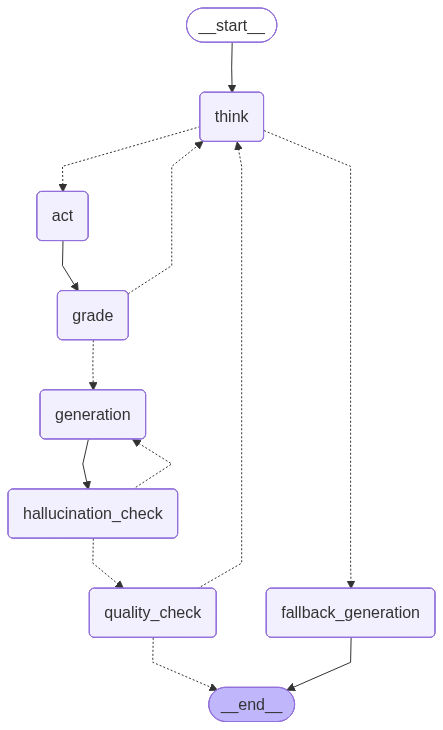

# Mahabharata Agentic RAG

A production-grade conversational AI system that answers questions about the Mahabharata using Agentic Retrieval-Augmented Generation (RAG). Built with LangGraph, it combines intelligent query planning, multi-tool retrieval, self-reflection, and a conversational chatbot interface.

---

## Table of Contents

- [Overview](#overview)
- [Architecture](#architecture)
  - [System Overview](#system-overview)
  - [ReAct Subgraph](#react-subgraph)
  - [Main Graph](#main-graph)
  - [Chatbot Graph](#chatbot-graph)
- [Features](#features)
- [Project Structure](#project-structure)
- [Setup](#setup)
- [Environment Variables](#environment-variables)
- [Running the Project](#running-the-project)
- [How It Works](#how-it-works)
- [Models Used](#models-used)
- [Tech Stack](#tech-stack)

---

## Overview

This project is a full agentic RAG system built on top of a 5800-page English translation of the Mahabharata. It goes beyond classic RAG by using an intelligent agent loop that:

- Plans how to retrieve information before searching
- Uses multiple retrieval tools (hybrid vector+keyword search, web search fallback)
- Grades retrieved chunks for relevance before generating answers
- Checks generated answers for hallucinations and completeness
- Wraps everything in a conversational chatbot with memory and persona

---

## Architecture

### System Overview

```
User Query
    │
    ▼
Chatbot Graph
    │
    ├── Intent Detection
    │       ├── RAG Query ──────────────────────────────────────┐
    │       ├── Greeting → Persona Response                     │
    │       └── Out of Scope → Decline                          │
    │                                                           ▼
    │                                               Main Graph (Planner)
    │                                                           │
    │                                               ┌───────────┴───────────┐
    │                                          Sequential              Parallel
    │                                               │                      │
    │                                               └───────────┬───────────┘
    │                                                           ▼
    │                                               ReAct Subgraph (per sub-task)
    │                                                           │
    │                                               Think → Act → Grade
    │                                                           │
    │                                               Generate → Hallucination Check
    │                                                           │
    │                                               Quality Check → Final Answer
    │                                                           │
    └───────────────────────────────────────────────────────────┘
                            Synthesized Response
```

---

### ReAct Subgraph

The core reasoning loop. For every sub-task, it runs:



**Nodes:**

| Node | Role |
|------|------|
| `think` | Picks the best tool and search query. Reads scratchpad to avoid repeating searches. Stops at max 5 iterations. |
| `act` | Calls the selected tool — hybrid search or web search. Appends result to state. |
| `grading` | Batch-grades all retrieved chunks for relevance. Accumulates good chunks across iterations. Re-queries if insufficient. |
| `generation` | Generates a draft answer using only relevant chunks. |
| `hallucination_check` | Verifies every claim in the draft is supported by retrieved chunks. Retries up to 3 times. |
| `quality_check` | Checks if the answer fully addresses the question. Triggers a focused re-retrieval if incomplete. |
| `fallback_generation` | Generates best-effort answer when max iterations are reached. |

---

### Main Graph

The orchestration layer that sits above the ReAct subgraph.

```
START
  │
  ▼
Planner ──► Executor ──► Synthesizer ──► END
              │
     ┌────────┴────────┐
  parallel          sequential
     │                  │
  Send() to         run one
  all sub-tasks     at a time
  simultaneously
```

**Nodes:**

| Node | Role |
|------|------|
| `planner` | Analyzes the query, breaks it into sub-questions, decides parallel or sequential execution. |
| `executor` | For sequential: runs one sub-task at a time. For parallel: dispatches all sub-tasks simultaneously via LangGraph `Send`. |
| `collect_response` | Receives each parallel subgraph result and appends to shared responses. |
| `synthesizer` | Combines all sub-answers into one coherent final response using an LLM. |

---

### Chatbot Graph

The conversational interface wrapping the main graph.

```
human_node (interrupt)
    │
    ▼
intent_node
    │
    ├── rag ──────────► rag_node ──────────────────────────────► human_node
    │                  (calls Main Graph)
    │
    ├── greeting ─────► salutation_node ──► exit? ──► END
    │                                          │
    │                                          └──────────────► human_node
    │
    └── out_of_scope ─► decline_node ──────────────────────────► human_node
```

**Nodes:**

| Node | Role |
|------|------|
| `human_node` | Captures user input via `interrupt()`. Builds context-aware message using last 6 chat history entries. |
| `intent_node` | Classifies the message as `rag`, `greeting`, or `out_of_scope`. |
| `rag` | Passes resolved query to the Main Graph. Prints and stores the response. |
| `salutation` | Responds in persona as the Mahabharata Encyclopedia. Detects exit intent. |
| `decline_node` | Politely declines out-of-scope questions, reminding the user of the chatbot's purpose. |

---

## Features

- **Agentic retrieval loop** — the agent decides when, what, and how to retrieve rather than following a fixed pipeline
- **Hybrid search** — combines dense vector search (BAAI/bge-base-en-v1.5) and BM25 keyword search via Reciprocal Rank Fusion
- **Web search fallback** — automatically falls back to DuckDuckGo when internal knowledge base is insufficient
- **Batch relevance grading** — grades all retrieved chunks in a single LLM call for efficiency
- **Hallucination checking** — strict grounding check for vector-retrieved answers, lenient for web-retrieved answers
- **Quality checking** — ensures the answer fully addresses the question before returning
- **Parallel execution** — independent sub-tasks run simultaneously using LangGraph `Send`
- **Sequential execution** — dependent sub-tasks run in order, each building on the previous
- **Conversational memory** — keeps last 6 chat messages for follow-up question resolution
- **Intent detection** — routes between RAG, greeting, and out-of-scope paths
- **Persona enforcement** — chatbot stays in character as the Mahabharata Encyclopedia
- **Multi-model routing** — different models for different tasks (reasoning, generation, grading, chat)
- **Automatic fallback** — NVIDIA primary → Groq primary → Groq alt on rate limits or errors

---

## Project Structure

```
Agentic-Rag/
│
├── schemas.py              # All TypedDict states and Pydantic schemas
├── prompts.py              # All LLM prompts
├── config.py               # API keys, model names, base URLs
├── llm.py                  # SmartLLM class with multi-model fallback
│
├── loading_txt.py          # PDF text extraction
├── chunker.py              # Text chunking with RecursiveCharacterTextSplitter
├── vector_store.py         # ChromaDB setup and loading
├── keyword_store.py        # Builds and saves BM25 document store as pickle
├── tools.py                # hybrid_search and web_search tool definitions
│
├── subGraph_nodes.py       # All ReAct subgraph node functions
├── subGraph.py             # ReAct subgraph compilation
│
├── mainGraph_nodes.py      # Planner, executor, synthesizer node functions
├── mainGraph.py            # Main graph compilation
│
├── chat_node.py            # All chatbot node functions
├── chatGraph.py            # Chatbot graph compilation
├── chatbot.py              # Chatbot runner with interrupt loop
│
├── chroma_db/              # Persisted ChromaDB vector store
├── db_with_keywords.pkl    # Serialized Document objects for BM25
│
└── .env                    # API keys (not committed)
```

---

## Setup

### Prerequisites

- Python 3.10+
- A Groq API key — [console.groq.com](https://console.groq.com)
- An NVIDIA NIM API key — [build.nvidia.com](https://build.nvidia.com)
- The Mahabharata PDF — [holybooks.com](https://www.holybooks.com/the-mahabharata-of-vyasa-english-prose-translation/)

### Installation

```bash
git clone https://github.com/vaslin-dotcom/Agentic-Rag.git
cd Agentic-Rag
pip install -r requirements.txt
```

### Required packages

```
langchain
langchain-community
langchain-openai
langchain-huggingface
langchain-chroma
langchain-classic
langchain-text-splitters
langgraph
openai
chromadb
sentence-transformers
pypdf
duckduckgo-search
ddgs
python-dotenv
tqdm
rank-bm25
```

### Build the knowledge base

Run these once before starting the chatbot:

```bash
# 1. Build the ChromaDB vector store
python vector_store.py

# 2. Build and save the BM25 document store
python keyword_store.py
```

---

## Environment Variables

Create a `.env` file in the project root:

```env
GROQ_API_KEY=your_groq_api_key_here
NVIDIA_API_KEY=your_nvidia_api_key_here
```

---

## Running the Project

### Start the chatbot

```bash
python chatbot.py
```

### Run the main graph directly

```bash
python mainGraph.py
```

### Run the ReAct subgraph directly

```bash
python subGraph.py
```

---

## How It Works

### Query flow — step by step

1. **User sends a message** — captured via `interrupt()` in the human node
2. **Query processor** — resolves follow-up references using conversation history ("tell me more about that" → "tell me more about Karna's relationship with Draupadi")
3. **Intent detection** — classifies as `rag`, `greeting`, or `out_of_scope`
4. **Planner** — breaks complex queries into sub-questions, decides parallel vs sequential execution
5. **Executor** — runs the ReAct subgraph for each sub-question
6. **ReAct loop** — for each sub-question:
   - `think` picks a tool and query
   - `act` retrieves chunks
   - `grading` filters relevant chunks
   - `generation` drafts an answer
   - `hallucination_check` verifies grounding
   - `quality_check` ensures completeness
7. **Synthesizer** — merges all sub-answers into one final response
8. **Output** — printed to user, saved to chat history

### Retrieval tools

| Tool | When used | How |
|------|-----------|-----|
| `hybrid_search` | Any Mahabharata question | EnsembleRetriever combining ChromaDB (weight 0.7) + BM25 (weight 0.3) |
| `web_search` | Outside Mahabharata scope | DuckDuckGo, returns top 4 results |

---

## Models Used

| Task | Provider | Model |
|------|----------|-------|
| Planning & reasoning | NVIDIA NIM | `moonshotai/kimi-k2-instruct-0905` |
| Answer generation | NVIDIA NIM | `moonshotai/kimi-k2-instruct` |
| Groq primary fallback (think) | Groq | `llama-3.3-70b-versatile` |
| Groq primary fallback (generation) | Groq | `meta/llama-4-scout-17b-16e-instruct` |
| Groq alt fallback (think) | Groq | `moonshotai/kimi-k2-instruct-0905` |
| Groq alt fallback (generation) | Groq | `openai/gpt-oss-120b` |
| Chatbot nodes | Groq | `llama-3.3-70b-versatile` |
| Embeddings | HuggingFace | `BAAI/bge-base-en-v1.5` |

---

## Tech Stack

| Component | Technology |
|-----------|------------|
| Agent framework | LangGraph |
| LLM interface | LangChain + LangChain OpenAI |
| Vector store | ChromaDB |
| Embeddings | HuggingFace (`BAAI/bge-base-en-v1.5`) |
| Keyword search | BM25 (rank-bm25) |
| Hybrid search | LangChain EnsembleRetriever + RRF |
| Web search | DuckDuckGo (ddgs) |
| PDF extraction | pypdf |
| LLM providers | NVIDIA NIM, Groq |
| Environment management | python-dotenv |
